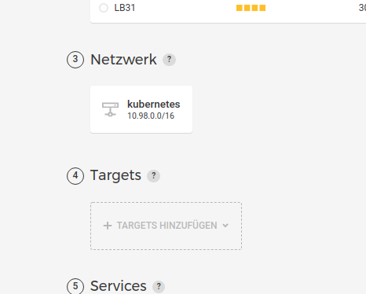

## Einleitung

Wir haben Kubernetes in der [Hetzner Cloud](https://www.hetzner.com/cloud) installiert und dann den [Cloud Load Balancer](https://www.hetzner.com/de/cloud/load-balancer) verwendet, um Traffic anzubinden. Nach ein paar Versuchen wollten wir die Dienste dann mit etwas Authentifizierung absichern. Die Einrichtung von [basic auth](https://en.wikipedia.org/wiki/Basic_access_authentication) funktionierte gut. Aber als wir versuchten einige Adressen ohne Authentifizierung durchzulassen, funktionierte das nicht.

Also will ich in diesem Tutorial zeigen, wie wir das konfiguriert haben. Unser Use-case ist wie folgt: wir haben ein paar Dienste im Kubernetes, die wir mit einem Passwortschutz ([basic auth](https://en.wikipedia.org/wiki/Basic_access_authentication)) versehen wollen. Trotzdem sollen einige Quelladressen z.B. unser Büro diese Passwortabfrage nicht erhalten, weil das sonst sehr nervig wäre.

### Voraussetzungen

* Ein laufendes Kubernetes Cluster in der [Hetzer Cloud](https://www.hetzner.com/cloud). Zur Einrichtung kann dieses [Tutorial](/tutorials/install-kubernetes-cluster) genutzt werden.
* Ein paar Grundkenntnisse im Umgang mit Kubernetes

*Dieses Tutorial wurde getestet mit Ubuntu 20.04 Hetzner Cloud Servern und Kubernetes Version v1.21.0*

## Schritt 1 - Ingress Konfigurieren

Wir haben die [offizielle Konfiguration](https://raw.githubusercontent.com/kubernetes/ingress-nginx/controller-v0.45.0/deploy/static/provider/cloud/deploy.yaml) genutzt, um unseren Ingress Dienst zu erstellen.

Als erstes muss die Konfigurationsdatei heruntergeladen werden:

    wget https://raw.githubusercontent.com/kubernetes/ingress-nginx/controller-v0.45.0/deploy/static/provider/cloud/deploy.yaml

Dann die Felder `use-forwarded-headers`, `compute-full-forwarded-for` und `use-proxy-protocol` zur data definition hinzufügen:

    # Source: ingress-nginx/templates/controller-configmap.yaml
    apiVersion: v1
    kind: ConfigMap
    metadata:
      labels:
        helm.sh/chart: ingress-nginx-3.27.0
        app.kubernetes.io/name: ingress-nginx
        app.kubernetes.io/instance: ingress-nginx
        app.kubernetes.io/version: 0.45.0
        app.kubernetes.io/managed-by: Helm
        app.kubernetes.io/component: controller
      name: ingress-nginx-controller
      namespace: ingress-nginx
    data:
      use-forwarded-headers: "true"
      compute-full-forwarded-for: "true"
      use-proxy-protocol: "true"

### Schritt 1.1 - Load Balancer erstellen und verbinden

Einen Load Balancer in der Hetzner Cloud Console erstellen. Dabei ist es wichtig, das richtige interne Netzwerk auszuwählen. Wir haben bei der Erstellung keine Dienste konfiguriert. Dies passierte automatisch, als wir den Ingress Dienst deployed haben.

Der Name des Load Balancers muss der Annotation entsprechen, so wie hier:

    ---
    # Source: ingress-nginx/templates/controller-service.yaml
    apiVersion: v1
    kind: Service
    metadata:
      annotations:
        load-balancer.hetzner.cloud/name: "kubelb"

Eine weitere Beschreibung wie der Load Balancer hinzugefügt werden kann, gibt es [hier](https://jmrobles.medium.com/how-to-setup-hetzner-load-balancer-on-a-kubernetes-cluster-2ce79ca4a27b).

Nachdem die beschriebenen Anpassungen an der `deploy.yaml` gemacht wurden, kann diese angewendet werden mit:

    kubectl -f deploy.yaml

Das komplette Konfigurationsbeispiel ist [hier](https://github.com/Wamoco/kubernetes/blob/master/services/ingress/deploy.yaml) zu finden.

## Schritt 2 - Proxy Protocol für den Load Balancer aktivieren

Nun in die Hetzner Cloud Console wechseln, um den Load Balancer zu konfigurieren. Hierfür den Reiter Services öffnen. Es kann ein paar Minuten dauern, bis die Dienste in der Cloud Console angezeigt werden. Dann die Option `Proxy Protocol` aktivieren.

Bitte beachten: zu diesem Zeitpunkt kann es sein, dass die Dienste nicht mehr erreichbar sind, falls die Ingress Konfiguration nicht korrekt ist. Das ist aber nicht so schlimm. Falls das passiert, kann das jederzeit wieder deaktiviert werden.

## Schritt 3 - Authentifizierung für die Dienste hinzufügen

Nun muss eine `service.yaml` für den Dienst erzeugt werden. Diese [Beispielkonfiguration](https://github.com/Wamoco/kubernetes/blob/master/services/phpinfo/deploy.yaml)
kann als Ausgangspunkt verwendet werden.

Dann ist es an der Zeit die Authentifizierung hinzuzfügen. Hier sind die annotations, welche wir verwendeten, um unseren Dienst zu schützen. Diese konfigurieren eine basic auth mit ein paar Ausnahmen.

Dem Dienst müssen folgende annotations hinzugefügt werden. Insbesondere `whitelist-source-range` muss hier angepasst werden.

    ...
    apiVersion: extensions/v1beta1
    kind: Ingress
    metadata:
      name: example
      annotations:
        kubernetes.io/ingress.class: nginx
        nginx.ingress.kubernetes.io/whitelist-source-range: 4.8.15.16/32,23.42.0.0/32
        nginx.ingress.kubernetes.io/satisfy: "any"
        nginx.ingress.kubernetes.io/auth-type: basic
        nginx.ingress.kubernetes.io/auth-secret: basic-auth
        nginx.ingress.kubernetes.io/auth-realm: "Authentication Required - Registry"
    ...

Halt stop. Wo sind denn die Zugangsdaten definiert? Nun, in diesem Beispiel kommen sie durch das secret `basic-auth`. Es wurde mittels `htpasswd` erstellt:

    $ htpasswd -c ./auth user

Diese Datei kann dann in Kubernetes als secret importiert werden. Bitte beachten, dass der name `basic-auth` genau dem Namen des `auth-secret` in der Service Definition entspricht.

    kubectl create secret generic basic-auth --from-file=auth

Abschließend dann den Dienst deployen mit:

    kubectl -f service.yaml

## Problembeschreibung

Quell IP Filter sind darauf angewiesen, dass im HTTP Header `X-Forwared-For` und `X-Real-IP` korrekt sind. Dies war für unser Setup zunächst nicht der Fall. Wir haben dies mit einem kleinen phpinfo Dienst ermittelt. Bitte die IP des privaten Netzes beachten. Keine Überraschung also, das das Whitelisting zunächst nicht klappen wolle. Die korrekte Adresse des Besuchers konnte nicht ermittelt werden.

Dies kann mit diesem [Beispiel](https://github.com/Wamoco/kubernetes/tree/master/services/phpinfo) selbst überprüft werden.

## Zusammenfassung

Nun können Sie Authentifizierung für Dienste im Kubernetes Cluster konfigurieren. Dabei handelt es sich um einen Standard Passwortschutz, von dem einige Quelladressen ausgenommen werden können.

##### License: MIT

<!--

Contributor's Certificate of Origin

By making a contribution to this project, I certify that:

(a) The contribution was created in whole or in part by me and I have
    the right to submit it under the license indicated in the file; or

(b) The contribution is based upon previous work that, to the best of my
    knowledge, is covered under an appropriate license and I have the
    right under that license to submit that work with modifications,
    whether created in whole or in part by me, under the same license
    (unless I am permitted to submit under a different license), as
    indicated in the file; or

(c) The contribution was provided directly to me by some other person
    who certified (a), (b) or (c) and I have not modified it.

(d) I understand and agree that this project and the contribution are
    public and that a record of the contribution (including all personal
    information I submit with it, including my sign-off) is maintained
    indefinitely and may be redistributed consistent with this project
    or the license(s) involved.

Signed-off-by: Bernhard <bl@wamoco.de>

-->
